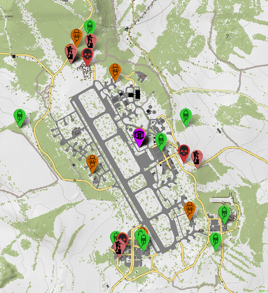

# [DayZ-SA.cz](https://dayz-sa.cz/)'s Event Viewer Tool
> Version v1.2

## Introduction

This tool utilizes [Leaflet.js](https://leafletjs.com) library to deliver interactive event visualization parsed from server log files.
By default it uses map data from [iZurvive](https://izurvive.com) (but you can easily provide your own).
It can be either invaluable admin tool or public showcase of interesting events.

However, this app does not provide all the required functionality on its own as logs provided by vanilla DayZ servers do not contain necessary information.
This can only be solved by using a mod for the server implementing required functionality.

Almost any behaviour of this tool can be configured from config files.
Read more about them in README file located in `config` directory.

**This application is not fool-proof! Invalid configuration may cause unexpected behaviour.**

## Installation
1. `git clone <this-repo-url> dayz-map` \
	_This step requires [Git](https://git-scm.com/) installed on your machine._ \
	You can alternatively download this repository in an archive.
2. `cd dayz-map`
3. `composer install` \
	_This step requires [Composer](https://getcomposer.org/) installed on your machine._
4. **Configure.** \
	Read more about configuration in this file.
5. **Deploy.** \
	Upload all the files to your webserver.

**Warning:** It is crucial that only `www` directory and its contents are publicly accessible.
Otherwise all configuration files (which might contain user serice credentials) will be exposed to public.

## Sources
| Directory        | Description
|------------------|-------------
| `app`            | Core application files.
| `app/control`    | Contains application source files allowing log access, and event processing.
| `app/templates`  | Location of `Latte` template files.
| `cache`          | Directory for both log and translated `Latte` templates cache.
| `config`         | Application configuration files are located here. 
| `config/servers` | Server configuration files are located here.
| `www`            | Publicly accessible files - map access and important application endpoints.

You should not have need to edit anything other than documented configuration files.
You can read more about configuration in README file located in `config` directory.
